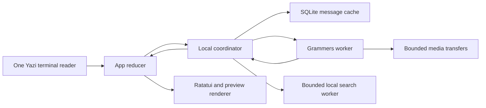

# Development and architecture

[简体中文](../zh-CN/Development.md) · [Guide](Home.md)

Follow [AGENTS.md](../../../AGENTS.md). Start from a described problem, inspect
upstream behavior and callers, implement, then validate. Local plans and
investigation output belong in ignored `dev-notes/`; user documentation belongs
here in both languages. Use descriptive feature branches and atomic buildable
Conventional Commits. Submit separate PRs, using explicit base branches when
changes depend on one another.

## Build and validate

Setup and credentials are in [Get started](Getting-Started.md). Use the pinned
Rust toolchain and committed lockfile:

```sh
cargo fmt --all -- --check
cargo clippy --locked --all-targets --all-features -- -D warnings
cargo test --locked --all-targets --all-features
cargo build --locked --release
python3 scripts/export-wiki.py --check
```

Keep small regressions for observable behavior and integration boundaries.
Existing tests cover reducer state, Unicode input, terminal rendering, cache
restart/replay, concurrent session processes, message-box recovery, folder
membership, Lua routing, local regex search, attachment identity and retention.
Use synthetic fixtures, not account credentials or downloaded private messages.
No TDD requirement or new general test framework is imposed. Do not duplicate
upstream parser/database tests. Formatting and linting apply to the root
workspace, preserving vendored upstream source conventions.

CI runs the same checks and installs each release with `cargo install --git`
from the checked-out Git revision on six native hosts. It exercises package
selection, repository-local patches, the lockfile, installation tracking and
the installed binary's version before packaging that executable. Build artifacts
are reused through Cargo's target directory. See [Updates](Updates.md)
for versioning and publication. Automated fixtures do not establish real Telegram
latency parity or verify a desktop file manager's selection behavior. For those,
use an authorized test account and the target operating system; do not send
messages to other people as an implicit test.

## Ownership and boundaries



- `src/app.rs` owns selection, focus, drafts and request generations. Feature
  reducers live in `src/app/`; rendering stays in `src/ui/`.
- `src/keymap.rs` loads declarative Lua and maps Yazi keys to actions. Contexts,
  counts, chords and hints share one binding collection. `config.lua` is user
  owned; managed settings and account-specific appearance are separate files.
- `src/telegram/local.rs` opens the account cache before networking, serves local
  requests, bounds commands waiting for authentication, and persists changes.
  `src/cache.rs` owns schema migration, history coverage, revisions and retention.
- `src/telegram/mod.rs` owns the client, update stream and task lifetimes.
  `requests.rs` bounds ordinary RPC work; transfers have a separate limit.
  Slow dialog/history/peer RPCs do not occupy the update-consumption path.
- `src/search.rs` scans local message text with the maintained regex engine.
  It has one active blocking scan and one replaceable pending request, generation
  checks, cancellation and cursor pagination. It never fetches remote history.
- `src/telegram/media_cache.rs` manages completed media and `tempfile` partials;
  `src/app/attachments.rs` adapts selected attachments to download/reveal actions.
  `src/terminal.rs` owns modes and cleanup, while `src/media.rs` coordinates
  graphics with the same output stream.

## Synchronization contracts

Cached display must not wait for authentication, dialogs or a full history scan.
The live update receive stays pinned while command and completion events are
handled; cancelling and recreating it can discard in-progress recovery. The
currently focused group uses Grammers' update engine with server-directed
channel-difference timeouts. General push processing and gap recovery continue
when active polling stops.

A durable cursor belongs to a complete covered update batch. Commit messages,
edits, tombstones and that cursor together; advancing a session cursor alone is
not evidence that message content is cached. Restore the application cursor on
restart. Too-long differences invalidate affected history before replacement
content. Replayed incoming messages must not double-count unread state.

Chat previews use the dialog's actual top message ID, not the last message in
a currently loaded historical window. In-flight snapshots cannot restore deleted
messages or overwrite newer edits/read state. Exact cached page boundaries
prevent sparse reply/search context from masquerading as complete history.
Account switching cancels old work and rejects stale request generations.

Only one process owns an account's message cache. File transfers and cleanup
retain the same lock lifetime. The underlying session format still supports
serialized SQLite writes, but two complete clients must not advance one message
cache independently. Keep the current rollback journal until upgrading the
bundled SQLite engine and reviewing the upstream WAL-reset fix.

## Reuse decisions

| Upstream | Reused or studied | Local responsibility |
| --- | --- | --- |
| Yazi `9203fd2604f867ab5ec18f24203b918975c4c00a` | Terminal lifecycle, parser, capabilities, TTY, public key normalization; pinned crates | Small adapters and visibility patch; no second input reader |
| Codex `78245b47af2a7aafcabe025828ceecca69db4df1` | Context precedence, chord cancellation, effective hints and composer UX | Design reference; no Codex TUI fork or copied plugin runtime |
| Telegram Desktop `4d4da471fbee771c10e173a83c003ba1728989f1` | Active-group recovery, native filter semantics and local-first storage | Behavioral reference through Telegram API/Grammers; no Desktop storage-format clone |
| Grammers 0.10.0 | MTProto transport and update ordering | Narrow batch/cursor/active-channel patches; retained upstream licenses |
| libSQL / regex / mlua / tempfile / ratatui-image | Storage, regex, bounded Lua evaluation, partial files, inline rendering | Application schemas, limits, commands and UX |

Source references: [Yazi](https://github.com/sxyazi/yazi/tree/9203fd2604f867ab5ec18f24203b918975c4c00a),
[Codex TUI](https://github.com/openai/codex/tree/78245b47af2a7aafcabe025828ceecca69db4df1/codex-rs/tui),
[Telegram Desktop](https://github.com/telegramdesktop/tdesktop/tree/4d4da471fbee771c10e173a83c003ba1728989f1),
[Telegram updates](https://core.telegram.org/api/updates),
[dialog filters](https://core.telegram.org/api/folders).

TDLib supplies a maintained client/database stack, but adopting it here would
replace authentication, message mapping, media and the existing Grammers
integration. The present change keeps Grammers and confines required adaptations
to documented SDK boundaries. Reconsider that choice if upstream maintenance or
update correctness can no longer be kept narrow.

Update all Yazi Git revisions together. Prefer released dependencies or immutable
Git revisions; never depend on sibling local checkouts. For copied code retain
licenses and document the repository, revision, source path and adaptations in
[vendor/README.md](../../../vendor/README.md). Remove superseded infrastructure
instead of maintaining two paths indefinitely.

## UX maintenance

Hints come from effective bindings. Empty editors use ghost text, and overlays
own input and provide an escape route. Preserve drafts and reading position
across view changes. State scope explicitly: loaded history is not full history,
cached search is not a server query, and a loading badge is not an empty result.
Color supplements focus markers rather than carrying meaning alone.

Keep English and Simplified Chinese pages together. The small
[Wiki export workflow](../README.md) validates page parity and internal links,
then maps this directory to GitHub Wiki filenames without a documentation framework.
