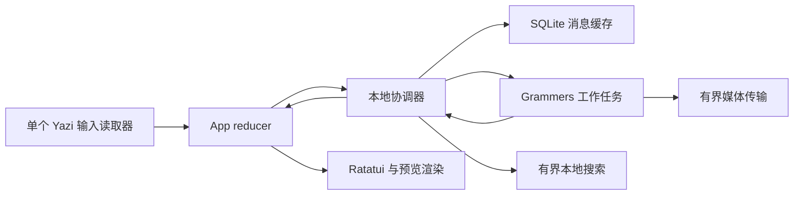

# 开发与架构

[English](../en/Development.md) · [指南首页](Home.md)

遵循 [AGENTS.md](../../../AGENTS.md)：先理解问题、上游实现及调用方，决定设计、完成实现后
再验证。本地计划与调查输出放在忽略的 `dev-notes/`，用户文档在这里同步维护两种语言。
使用描述性功能分支与可构建的原子 Conventional Commits；功能拆分为独立 PR，有依赖时明确基底分支。

## 构建与验证

环境和凭据见[快速入门](Getting-Started.md)，使用固定工具链与提交的锁文件：

```sh
cargo fmt --all -- --check
cargo clippy --locked --all-targets --all-features -- -D warnings
cargo test --locked --all-targets --all-features
cargo build --locked --release
python3 scripts/export-wiki.py --check
```

只保留验证可观察行为和集成边界的少量回归测试。现有覆盖包括 reducer、Unicode 输入、
终端渲染、缓存重启/重放、会话跨进程写入、更新恢复、文件夹规则、Lua 路由、本地正则搜索、
附件身份与淘汰。使用合成数据，不使用真实账号凭据或私人消息。
不要求 TDD，不引入通用测试框架，不重复上游解析器或数据库测试。
格式与 lint 面向根工作区，保留 vendored 上游代码原有风格。

CI 在六个平台上通过 `cargo install --git` 安装检出的 Git 提交，验证包选择、仓库内依赖
补丁、锁文件、Cargo 安装记录和已安装程序的版本，再打包该可执行文件；通过 Cargo
目录 `target/cargo-install` 复用产物，与工作区构建及其 build-script 元数据分开。
版本与发布见[更新](Updates.md)。自动化数据不能证明
与 Telegram 的真实延迟一致，也不能代替目标平台文件管理器的人工验证。
这些验证需要获准的测试账号与对应系统，不应默认给其他人发消息来测试。

## 所有权和边界



- `src/app.rs` 管理选择、焦点、草稿和请求代次，功能 reducer 在 `src/app/`，渲染在 `src/ui/`。
- `src/keymap.rs` 加载声明式 Lua，把 Yazi 按键映射为动作。上下文、数量、组合键和提示使用
  同一组绑定。`config.lua` 归用户所有，托管设置和账号外观另存。
- `src/telegram/local.rs` 在联网前打开账号缓存，处理本地请求、限制认证前的待执行命令并
  持久保存更新。`src/cache.rs` 负责迁移、历史覆盖范围、修订与保留策略。
- `src/telegram/mod.rs` 管理客户端、更新流和任务生命周期，`requests.rs` 限制普通 RPC，
  传输另有额度。较慢的列表、历史或 peer RPC 不占用更新消费路径。
- `src/search.rs` 用维护中的 regex 引擎扫描本地文本，一个运行中的阻塞扫描加一个可替换
  待执行请求，支持代次校验、取消和游标分页，不请求远端历史。
- `src/telegram/media_cache.rs` 管理完整文件和 `tempfile` 临时文件，
  `src/app/attachments.rs` 连接消息选择与下载/定位操作。
  `src/terminal.rs` 负责模式及恢复，`src/media.rs` 通过同一输出流协调图形。

## 同步约束

缓存展示不能等待认证、完整聊天列表或全历史扫描。更新接收 future 在处理命令和完成事件
期间保持存活，取消重建它可能丢失进行中的恢复。当前聚焦群组使用 Grammers 更新引擎和
服务端要求的 channel difference 间隔；停止活跃轮询时，一般推送与缺口恢复继续工作。

持久游标属于完整且已覆盖的更新批次。消息、编辑、删除标记与游标一起提交；会话游标推进
不代表消息已缓存。重启恢复应用自己的游标。过长差异先使相关历史失效，再接收替代数据。
重放新消息不能重复增加未读数。

聊天预览以真正的 top message ID 为准，不使用当前历史窗口最后一条。进行中的旧快照不能
恢复已删消息或覆盖新编辑、已读状态。精确的缓存分页边界避免把稀疏回复/搜索上下文当成
完整历史。切换账号取消旧工作，并拒绝过期请求代次。

每个账号消息缓存只能有一个进程所有者，文件传输与清理共享该锁生命周期。
底层 session 格式仍支持串行化 SQLite 写入，但两个完整客户端不能独立推进同一个消息缓存。
升级内置 SQLite 并检查上游 WAL-reset 修复前，保留当前 rollback journal。

## 复用决策

| 上游 | 复用或调研内容 | 本地职责 |
| --- | --- | --- |
| Yazi `9203fd2604f867ab5ec18f24203b918975c4c00a` | 终端生命周期、解析、能力探测、TTY、公开按键标准化；固定版本依赖 | 小型适配层与可见性补丁，不创建第二个输入读取器 |
| Codex `78245b47af2a7aafcabe025828ceecca69db4df1` | 上下文优先级、组合键取消、实际按键提示、输入框 UX | 设计参考，不 fork 整个 TUI 或复制插件运行时 |
| Telegram Desktop `4d4da471fbee771c10e173a83c003ba1728989f1` | 活跃群恢复、原生过滤规则、本地优先存储 | 通过 Telegram API/Grammers 对齐行为，不复制 Desktop 存储格式 |
| Grammers 0.10.0 | MTProto 传输与更新顺序 | 批次/游标/活跃群的局部补丁，保留上游许可证 |
| libSQL / regex / mlua / tempfile / ratatui-image | 数据库、正则、有界 Lua 求值、临时文件、内联渲染 | 应用 schema、资源限制、命令与 UX |

参考源码：[Yazi](https://github.com/sxyazi/yazi/tree/9203fd2604f867ab5ec18f24203b918975c4c00a)、
[Codex TUI](https://github.com/openai/codex/tree/78245b47af2a7aafcabe025828ceecca69db4df1/codex-rs/tui)、
[Telegram Desktop](https://github.com/telegramdesktop/tdesktop/tree/4d4da471fbee771c10e173a83c003ba1728989f1)、
[Telegram 更新协议](https://core.telegram.org/api/updates)、
[文件夹协议](https://core.telegram.org/api/folders)。

TDLib 提供维护中的客户端/数据库体系，但在这里采用它将替换认证、消息映射、媒体和现有
Grammers 集成。本次保留 Grammers，把所需修改限制在有说明的 SDK 边界；如果以后无法
以小范围维护保证更新正确性，再重新评估。

升级时统一更新所有 Yazi Git revision。优先发行依赖或不可变 Git revision，不能依赖
机器旁边的本地 checkout。复制源码必须保留许可证，并在
[vendor/README.md](../../../vendor/README.md) 记录仓库、版本、原路径与修改。
替换后删除废弃基础设施，避免长期维护两条路径。

## UX 维护

提示来自实际绑定；空输入框用 ghost text，浮层接管输入并保留退出路径。
切换视图保留草稿与阅读位置。明确范围：加载窗口不是全量历史，缓存搜索不是服务器搜索，
加载中不等于没有结果。颜色辅助焦点标记，不单独承担状态含义。

英文与简体中文一起更新。[Wiki 导出流程](../README.md) 校验页面对应关系和内部链接，
再将源目录映射为 GitHub Wiki 文件名，无需引入文档框架。
